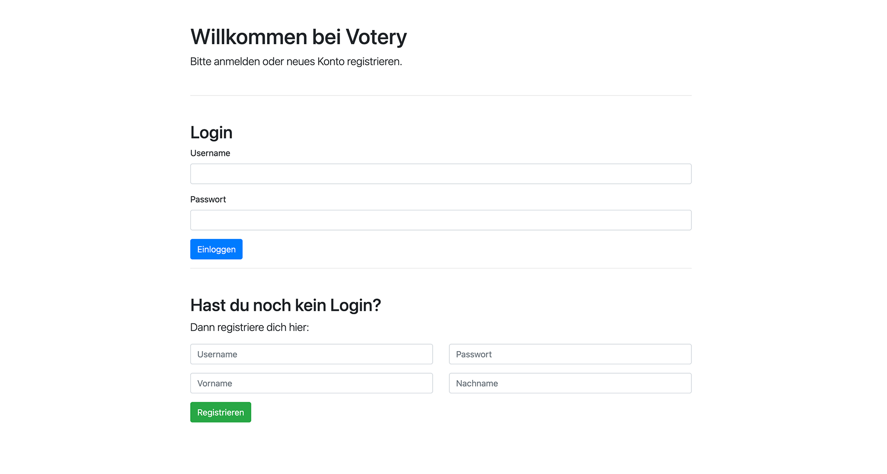

# Votery  
Dieses Projekt ist im Rahmen des Moduls *Programmierung 2* an der Fachhochschule Graubünden entstanden.   
  
## Ausgangslage  
In einem Team mit mehreren Mitarbeitern gibt es Abstimmungen über Produkte, mit denen Sonderaktionen durchgeführt werden sollen. Bis anhin fanden diese Abstimmungen per umständlichem Mail-Verkehr statt.   
  
## Projekt – Votery  
Das Tool ***Votery*** unterstützt das Team beim Abstimmungsprozess, indem alle Produkte und zugehörige Abstimmungsergebnisse zentral gespeichert werden. Ein Login für ***Votery*** sorgt dafür, dass einfach für Produkte gevoted werden kann.   
  
## Installation  
Damit ***Votery*** lokal gestartet werden kann, werden mindestens folgende Installationen (getestete Version) benötigt:   
 - `Python (3.8)`  
 - `Flask (1.1.2)`  
 - `Jinja2 (2.11.2)`  
 - `Plotly (4.13.0)`  
 
Alternativ können alle Abhängigkeiten über den Befehl `pip3 install -r requirements.txt` installiert werden.
Zusätzlich wird eine aktive Internetverbindung zum Ausführen der Anwendung vorausgesetzt. 
  
Im Anschluss kann das Tool mit den folgenden Befehlen gestartet werden:   

**MacOS / Linux**  
```  
FLASK_APP=app.py  
flask run  
```

**Windows**  
```  
set FLASK_APP=app.py  
flask run  
```

Danach lässt sich das Tool über den Localhost (i.d.R 127.0.0.1, Port 5000) aufrufen.
  
## Anforderungen  
Für die Umsetzung des Projekts wurden die folgenden Anforderungen definiert:   
  
1. Der Benutzer muss sich registrieren bzw. einloggen können.   
2. Der Benutzer muss ein neues Produkt erfassen und damit eine neue Abstimmung eröffnen können.   
3. Der Benutzer muss sein Voting zu bereits erfassten Produkten abgeben können.   
4. Der Benutzer muss Kategorien und Logins verwalten können.   
5. Der Benutzer muss die Abstimmungsergebnisse prüfen können.   
6. Der Benutzer muss erfasste Produkte bearbeiten können.   
  
## Workflow  
  
### Dateneingabe  
Der Benutzer kann über das UI neue Produkte erfassen oder über die Detailsansicht Produkte bearbeiten. Zudem können neue Kategorien und weitere Benutzer ergänzt werden. 

### Datenverarbeitung / Speicherung
Die eingetragenen Daten werden im Ordner `data` ins das jeweilige JSON-File abgespeichert:

**data.json**
 - Dictionary mit Produktdaten und Votings

**categories.json**
 - Liste mit allen Kategorien

**users.json**
 - Dictionary mit verschlüsselten Login-Daten

### Datenausgabe
Die Daten werden entsprechend der URL, die der Benutzer aufruft, vom JSON gelesen. Im Anschluss werden die notwendigen Daten mittels Jinja2 im Front-End ausgegeben. 


## Benutzeranleitung

Einloggen oder neu registrieren. Für Demo-Zwecke kann der Admin-Account verwendet werden:   
- Username: "Admin"  
- Passwort: "admin"  
  
  
  
  
Auf der Seite ***Voting*** (links) sieht der eingeloggte User alle Produkte, für welche er noch nicht abgestimmt hat. In der Spalte "Voting" kann er für oder gegen das Produkt stimmen. 
Auf der Seite ***Alle Einträge*** (rechts) sieht der User alle in der Datenbank erfassten Produkte. Die Pagination zeigt jeweils 10 Produkte pro Seite. Durch Klick auf das Detail-Icon öffnet sich die Detailseite des gewählten Produktes. 

  
  

Auf der Detailseite (links) eines Produktes sind sämtliche Informationen sichtbar. Zusätzlich sieht der Nutzer die Abstimmungsergebnisse als Tabelle und grafische Darstellung.
Durch Klick auf den Button "Bearbeiten" öffnet sich ein Dialog-Fenster (rechts) zum Anpassen der Produktdaten.

  

Unter dem Menü-Punkt ***Neuer Eintrag*** kann der Nutzer ein neues Produkt hinzufügen, wofür eine Abstimmung erstellt werden soll.
Auf der Seite ***Kategorien*** können neue Kategorien hinzugefügt oder entfernt werden.  
  
  

Unter dem Menü-Punkt ***Aktueller Benutzer > Benutzer verwalten*** können Benutzer hinzugefügt oder entfernt werden. 


